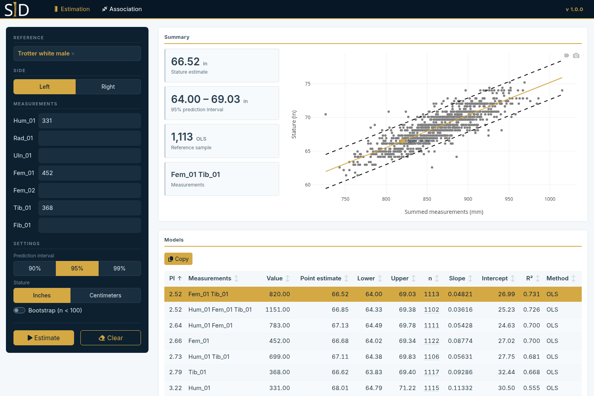

# SID

Stature identification. SID estimates living stature from skeletal measurements, and tests whether a known stature is consistent with a skeleton, by regression on reference populations.

- **Estimation:** stature predicted from the measurements of one side, with a prediction interval. Every combination of the measurements entered is a model; the analyst chooses among them.
- **Association:** whether a known stature fits the measurements of one bone.



## How it is built

| Part | What it is | Where |
|---|---|---|
| SIDJ | The method: a Julia package with no web or database code | `SIDJ/` |
| Server | A Julia HTTP server: loads reference data, runs SIDJ, serves the page | `server/` |
| Page | Static HTML, CSS and JavaScript on Bootstrap 5; no build step | `web/` |
| Reference data | ARDS, a PostgreSQL database, read-only | external |

The server reads the reference groups from ARDS when the page is opened, so a collection, individual or measurement switched off for stature in ARDS (`stature_method`) disappears from the app on the next page load.

Bones are listed head to toe, by the number each measurement has in the data collection manual (the `utk2016` column of `osteometry.measurements`), as in OsteoSort.

## Using the app

1. Choose one or more **reference groups**. Selecting several pools their individuals.
2. **Estimation:** choose the side and type the measurements. **Association:** choose the element and side, type the known stature, in inches or centimetres as the toggle beside it says, and the measurements.
3. Choose the **prediction interval** (90, 95 or 99%). Estimation's **Settings** also hold whether stature is given in inches or centimetres, and whether small samples are bootstrapped.
4. Press **Estimate** or **Associate**.

On a screen wider than 1920 pixels the page is shown larger, so it does not sit small in a corner: 1.25 times at 2560 pixels, 1.75 at 3840.

**The method.** A model sums the measurements it uses. Estimation regresses stature on that sum over the reference individuals who have every one of the measurements, on the chosen side, joining an individual's bones; association regresses the sum of one bone's measurements on stature. Both fit ordinary least squares and give the normal-theory prediction interval. Association's p-value is a two-sided t-test of the specimen's sum against the value predicted at the known stature. A model needs at least 10 reference individuals.

**Estimation results.** One row per model, sorted by **PI**, the half-width of the prediction interval (point estimate minus lower bound). The narrowest is chosen to begin with; clicking another row shows its plot and summary. Hovering a row's sample size `n` shows which reference groups it came from. **Copy** puts the chosen model on the clipboard under the column headings, with the reference groups, ready to paste into a spreadsheet or report.

**Bootstrap.** With **Bootstrap (n < 100)** on, a model fitted to fewer than 100 individuals gets its interval by resampling instead; the **Method** column says which models did. The point estimate stays the least-squares one. For each of 50,000 draws the residuals are resampled with replacement and added to the fitted values, the line is refitted and its prediction at the specimen taken, and noise from the full fit's residual spread is added (a draw from a normal distribution with that spread); the interval is the percentiles of those draws. Resampling residuals rather than individuals keeps the measurements fixed, so every refit is well defined and the spread is not understated by repeated individuals.

The draws are random but reproducible. They start from a seed worked out from the model's own data: the reference individuals' summed measurements and statures, the specimen's value, the interval and the number of draws. So the same specimen against the same reference data always gets the same interval, in whatever order the reference groups were chosen and whatever other measurements were entered, and a later release gives it again. Change any of those, or the reference data in ARDS, and the draws are new ones. With 50,000 draws a bound lies within about 0.3% of the interval's width of the value endless draws would give. (The R SID made 5,000 draws from an arbitrary start, so its bounds moved by about 1% of the width from one run to the next.)

**Units.** Measurements are in millimetres. ARDS holds stature in centimetres; in inches it is divided by 2.54.

## Local development

You need Docker, Julia 1.13 and a copy of ARDS.

**1. Start ARDS.** Build and load it as its own README describes, as a container named `ards-db`, then put it on a network the app can share:

```sh
docker network create sid-dev
docker network connect sid-dev ards-db
```

**2. Give the app its credentials.** Create `.env` in the repository root (it is git-ignored), without quotes around the values:

```
DB_HOST=ards-db
DB_PORT=5432
DB_NAME=ards
DB_USER=statureid
DB_PASS=<the statureid user's password>
```

**3. Run the server.**

```sh
dev/julia.sh -e 'using Pkg; Pkg.instantiate()'                 # first time only
dev/julia.sh -e 'using SIDServer; SIDServer.main()'            # http://127.0.0.1:3838/
```

`dev/julia.sh` runs Julia for the server package with the variables from `.env`. It uses the Julia 1.13 on your machine if there is one (reaching ARDS on `127.0.0.1`), and a Julia container on the `sid-dev` network otherwise. Changes to files in `web/` show on reload; changes to Julia code need a restart.

### Tests

All tests live in `test/`.

| What | Command | Needs |
|---|---|---|
| `test/sidj`: the method, on made-up data and against numbers from R | `PROJECT=SIDJ dev/julia.sh -e 'using Pkg; Pkg.test()'` | nothing |
| `test/server`: the API and its refusals | `dev/julia.sh -e 'using Pkg; Pkg.test()'` | ARDS |
| `test/parity`: the R/Shiny SID 0.1.0 against this one | see below | ARDS, Docker |
| `test/browser`: the real page in a headless browser, compared with the API | see below | a running server |

The first two also run on GitHub for every push (`.github/workflows/tests.yml`), where the server's tests skip the parts that need ARDS. Each release additionally builds the image and checks that it starts and serves the page (`.github/workflows/release.yml`).

**Comparison with the R SID.** `test/parity/capture.sh` runs the R SID's own analysis code, taken from its last commit, on a few thousand made-up cases against ARDS in R 4.4.3, and saves what it gives. `compare.jl` sends the same cases through this server and reports every difference:

```sh
test/parity/capture.sh                  # about 25 minutes, most of it the R bootstrap
dev/julia.sh test/parity/compare.jl
```

Against ARDS of October 2026, over 3,161 cases and 38,907 models, every refusal and every number matched, but for one estimate lying exactly on a rounding boundary (166.795, which the two round to 166.79 and 166.80 from the last bit of the arithmetic). Bootstrap bounds can only match within the randomness of the draws: over 4,113 bootstrapped models they differed by a median of 1.0% of the interval width, without bias, as two runs of the R SID differ from each other.

**Browser test.** After changing anything in `web/`, run it against a running server:

```sh
docker run --rm --network host --user "$(id -u):$(id -g)" -e HOME=/tmp \
  -v "$PWD:/app:z" -w /app mcr.microsoft.com/playwright/python:v1.49.0-jammy \
  sh -c "pip install -q playwright==1.49.0 && python test/browser/test_ui.py"
```

`SIDJ/test/runtests.jl` and `server/test/runtests.jl` are the files Julia's `Pkg.test()` looks for; each only points into `test/`.

### Scripts

| Script | Purpose |
|---|---|
| `dev/julia.sh` | Run Julia for the server (or, with `PROJECT=SIDJ`, for SIDJ) with the settings from `.env` |
| `dev/run-image.sh` | Compile the Julia side, build the image and run it as Atlas does, on http://127.0.0.1:3839/ |

## Configuration

Everything comes from the environment.

| Variable | Default | Meaning |
|---|---|---|
| `DB_NAME`, `DB_USER`, `DB_PASS` | required | ARDS database and read-only login |
| `DB_HOST` | `host.docker.internal` | ARDS host |
| `DB_PORT` | `5432` | ARDS port |
| `PORT` | `3838` | Port the server listens on |
| `REFERENCE_MAX_AGE_SECONDS` | `30` | How old the loaded reference data may be before a page load re-reads ARDS |

`server/config/default_references.csv` lists the groups selected when the page opens.

## Deployment

SID is deployed through Atlas, which builds the `Dockerfile` in this repository and runs the image.

| Atlas setting | Value |
|---|---|
| Dockerfile path | `Dockerfile` |
| Container port | `3838` |
| Launch path | `/` |
| Health-check path | `/healthz` |
| ARDS database access | Read-only |

The image compiles nothing. The Julia side is compiled once per release into a standalone program and attached to the GitHub Release; the `Dockerfile` downloads it and adds the page. So a release must have its asset before that tag is deployed.

### Releasing

1. Set the version in `VERSION` (shown in the app header) and `ARG SID_VERSION=vX.Y.Z` in the `Dockerfile`. Update the citation below and in `CITATION`. Commit and push.
2. Publish a GitHub Release with tag `vX.Y.Z`. For a pre-release, use a tag like `vX.Y.Z-alpha.1` (with `X.Y.Z-alpha.1` in `VERSION`) and tick **Set as a pre-release**.
3. `.github/workflows/release.yml` checks that `VERSION` and the `Dockerfile` match the tag, compiles the program with `build/Dockerfile`, builds the image from it, checks that it starts, and attaches `sid-linux-x86_64.tar.gz` to the release.
4. Once the asset is on the release, deploy tag `vX.Y.Z` in Atlas.

If the workflow fails, nothing is attached and a deploy of that tag fails at the download step. Fix the problem and re-run the workflow.

## Repository layout

```
SIDJ/                 The method (Julia package)
  src/regression.jl     the fitted line, its prediction interval, the bootstrap
  src/data.jl           reference groups and the samples drawn from them
  src/estimate.jl       stature estimation: one model per set of measurements
  src/associate.jl      stature association
server/               The HTTP server (Julia package)
  src/                  reference loading, API
  config/               default reference groups
web/                  The page: index.html, css/, js/, vendored libraries
test/                 All tests
  sidj/                 the method, on made-up data; no database
  server/               the API against ARDS
  parity/               the R SID against this one
  browser/              the page in a headless browser
build/Dockerfile      Compiles the Julia side into a standalone program
Dockerfile            What Atlas builds
.github/workflows/    tests.yml (every push), release.yml (each release)
dev/                  Local scripts
VERSION               The version shown in the app
```

## Open questions

**The bootstrap's observation noise.** Each bootstrap draw adds noise to the refitted prediction from a normal distribution whose spread is the residual standard error of the one full fit. The bootstrap is used for small reference samples, and that is where this is least sure: with few individuals their scatter may not be normal, and its spread is itself an estimate, yet every draw uses it as if it were known. As most of an interval's width comes from this noise rather than from the refitted lines, the interval rests largely on that assumption. One effect is that it comes out narrower than the least-squares interval, which allows for the uncertain spread by using the t distribution: for the twelve made-up individuals in `test/sidj`, 3.96 against 4.53. Whether the noise should instead be drawn from the resampled residuals themselves, which assumes no shape, is undecided; the procedure is kept as it was specified for the R SID until it is.

A related point, about computing and not about the method: with the noise drawn at random, the lowest and highest 2.5% of the draws are where chance shows most, which is why a bound still differs from its limiting value in the third decimal place or so. Since the distribution the noise is drawn from is known, the percentiles could be worked out from it directly, giving the same interval with far less of that chance left in. This is not done, for the same reason: it would no longer be the procedure as specified.

## Acknowledgments

- **Alex Moore** — UI styling suggestions and design inspiration

## Citation

Lynch, J.J. 2026 SID. Stature Identification. Version 1.0.0. Defense POW/MIA Accounting Agency, Offutt AFB, NE.

## License

GNU General Public License v2.0
